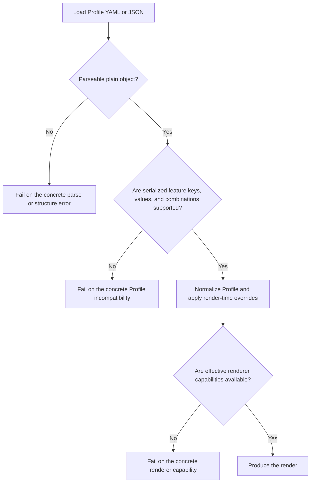
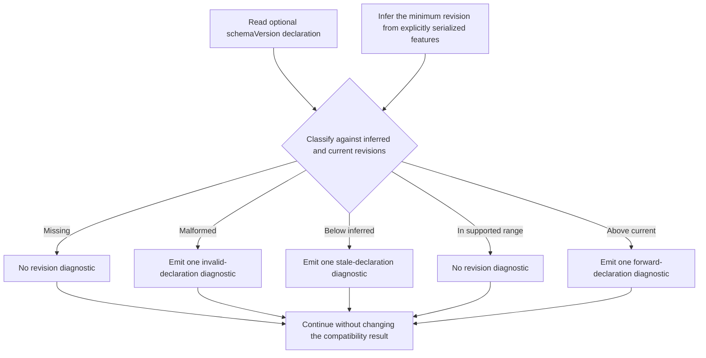

## Goal

Define how an optional Markdown PDF Profile `schemaVersion` can identify the
serialized feature contract used by a Profile without becoming an exact-
equality gate.
The tool must continue to decide compatibility from the actual Profile keys,
values, cross-field rules, and effective renderer requirements.

This research also defines how Profile revision signaling differs from package
versions, renderer versions, persisted report schemas, fixture catalogs,
harness digests, and ownership markers.

## Research At A Glance

Markdown PDF Profiles currently rely on strict key, value, cross-field, and
renderer-capability validation. The settled contract adds an optional top-level
`schemaVersion` as an advisory Profile feature revision:[^profile-schema]

```yaml
schemaVersion: 3

pageNumbers:
  enabled: true
  scope: body
  countFrom: document
  start: 1
  increment: 1
```

> `schemaVersion` declares the Profile feature contract known by its producer.
> Actual serialized features determine reader compatibility, and normalized
> effective behavior determines renderer compatibility.

### Render Compatibility



### Revision Consistency



A wrong declaration does not block a correct render. Unknown features, invalid
feature content, unreadable Profile syntax, and unavailable effective renderer
capabilities retain their concrete failure behavior.

## Scope

This research covers:

- the optional Profile `schemaVersion` declaration
- recognition of missing, malformed, stale, current, and newer declarations
- a serialized-feature registry and inferred minimum Profile revision
- hard-error versus advisory-diagnostic boundaries
- generated Profile and base-Profile behavior
- strict unknown-key validation and forward-compatible known-key handling
- separation from WeasyPrint capability versions and other artifact versions
- implementation and validation implications for Phase 13

This research does not:

- change the meaning or defaults of existing Markdown PDF Profile fields
- allow unknown Profile keys to be silently ignored
- replace field, cross-field, Template, or renderer-capability validation
- define package release or canary versioning
- make a Profile revision an allowlist of WeasyPrint versions
- define migrations for a breaking Profile semantic change that does not yet
  exist
- change the version policy of a persisted report without auditing its reader
  and compatibility requirements

## Starting Contract

At the Phase 13 starting boundary, the Profile root allowlist contained
`profile`, page, ToC, metadata, PDF, font, cover, header, footer, page-number,
title-block, and code settings. A top-level `schemaVersion` was not accepted.
The optional `profile` object was identity metadata for generated Profiles and
did not describe the whole artifact schema.[^profile-schema]

Profile parsing followed this path:

```text
parse YAML or JSON
  -> require a plain object
  -> reject unknown keys at each bounded schema level
  -> normalize known values and apply defaults
  -> derive render recipe options
```

Renderer-sensitive fields have a separate capability matrix that maps effective
Profile fields to minimum WeasyPrint versions. Capability validation runs only
for behavior actually requested after normalization and overrides; it must not
be replaced by Profile revision comparison.[^renderer-capabilities]

Other repository artifacts use version numbers for different reasons. The
Markdown PDF Codex Profile report has a reader that currently requires its
exact report-artifact version. Page-number renderer fixtures, harnesses, and
temporary evidence reports have separate internal histories. Phase 13 must
audit each value against its real consumer instead of treating all numbers as
one Markdown PDF schema.[^codex-report]

## Settled Contract

### Field Ownership And Shape

`schemaVersion` is an optional top-level Profile field because it describes the
serialized Profile as a whole. It does not belong inside the optional
generated-identity `profile` object.

The serialized name remains `schemaVersion`; public documentation should call
it an advisory Profile feature revision so the name does not imply an
exact-version gate.

When generated, the value should be a positive safe integer. A reader recognizes
only a runtime number for which `Number.isSafeInteger(value)` is true and
`value > 0`. YAML or JSON numeric strings such as `"1"`, booleans, null,
objects, arrays, non-positive numbers, fractional numbers, non-finite numbers,
and integers above `Number.MAX_SAFE_INTEGER` are unusable declarations. A
lexical value such as `1.0` is accepted when parsing produces the runtime number
`1`; the reader does not depend on source spelling. Missing and unusable
declarations do not reject the Profile by themselves and are never coerced.

The declaration assigns the current canary contract revision `3`, the first
revision written into generated Profiles. Revision `2` remains the historical
baseline for the stable `v0.1.6` Profile contract, although that release's
Profiles did not serialize the declaration.

### Revision Meaning And Bump Rules

A revision is a monotonically increasing checkpoint in the accepted serialized
Profile feature contract. Increase it when the contract adds a recognized key,
an accepted value for an existing key, a supported field combination, or
another serialized construct that an older reader would reject.

Do not increase it for internal refactoring, diagnostic wording, renderer
candidate additions, formatting changes, or a fix that restores documented
behavior. A breaking reinterpretation of an existing feature cannot rely on
this advisory revision alone; it requires separate compatibility research and
an explicit reader boundary.

The initial recorded lineage is:

| Revision | Contract boundary                         | Declaration behavior                               |
| -------- | ----------------------------------------- | -------------------------------------------------- |
| `2`      | stable `v0.1.6` Profile contract          | historical baseline; Profiles remained unversioned |
| `3`      | additive `v0.1.7` canary Profile contract | current revision and first emitted declaration     |

Phase 13 must inventory the exact boundary: features already supported at
`v0.1.6` receive `introducedIn: 2`, while additive canary features receive
`introducedIn: 3`. Known additions include page-number sequence controls,
expanded page-number scope, and page-chrome styling. The inventory must confirm
the complete set rather than treating these examples as exhaustive.

This mapping preserves the recorded revision-2 baseline without claiming that
`v0.1.6` serialized the field or reconstructing an undocumented revision-1
feature set. The font-discovery evidence report's schema `2`, profile-font smoke
schema `1`, and renderer evidence schema `3` remain unrelated artifact axes.

### Compatibility Authority

Compatibility remains authoritative in this order:

```text
1. actual key recognition
2. actual value and cross-field validation
3. structural and Template compatibility
4. effective renderer-capability validation
5. schemaVersion consistency diagnostics
```

Revision comparison reports consistency only after the tool establishes actual
support. It neither authorizes unknown content nor invalidates supported
content.

### Feature Registry

One registry should describe supported serialized Profile features. A simple
key entry is:

```ts
{
  path: "pageNumbers.countFrom",
  introducedIn: 3,
  validate: validatePageNumberCountOrigin,
  normalize: normalizePageNumberCountOrigin,
  rendererCapability: "pageNumbers.countFrom.body",
}
```

The exact implementation may group fields by bounded object rather than store
every leaf as a flat record. When a later revision adds a value or supported
combination under an existing key, the registry needs a value- or rule-level
feature entry so inference can distinguish that addition. A cross-field entry
names its participating paths and validator; it does not pretend to be a leaf
key.

The registry may delegate validation and normalization to focused modules, but
those modules must be registered through this one owned rule set rather than
discovered through a second independent table.

Regardless of representation, the registry must be the authoritative source
used to derive:

- recognized keys, values, and bounded combinations
- each serialized feature's introduction revision
- the minimum revision implied by explicitly serialized Profile content
- value and cross-field validation routing
- normalization routing
- renderer-capability requests where applicable
- human and structured diagnostic field paths

Do not maintain an independent `revision -> keys[]` table that can drift from
the validator. A revision-specific feature view must be derived from the same
registry.

Dynamic maps such as metadata and language-tagged font mappings remain bounded
features with their existing entry validators. Their arbitrary member names do
not each become separately versioned schema keys.

Inference uses explicitly serialized recognized features before defaults are
inserted. Normalization defaults and one-render CLI overrides do not raise the
inferred Profile revision. Effective renderer requirements are calculated
separately from normalized content and render-time overrides.

The inferred minimum has a revision-2 floor, including for an empty Profile.
Above that floor, inference takes the highest `introducedIn` value matched by
explicitly serialized features.

`schemaVersion` is declaration metadata and never contributes an introduction
revision to the inferred minimum. Only serialized Profile feature keys, values,
and supported combinations do.

Implementation ownership should live in new focused Profile modules:

- `profile/feature-registry.ts` owns feature entries and introduction metadata
- `profile/revision.ts` parses the declaration, infers the minimum revision,
  and classifies its state
- `profile/schema.ts` consumes the registry for structural enforcement instead
  of retaining parallel key tables
- `profile/normalize.ts` remains the normalization orchestrator and carries the
  source-derived revision assessment in `MarkdownPdfProfileLoadResult`

The declaration does not become part of `NormalizedMarkdownPdfProfile`, because
it has no rendering meaning.

### Declaration States And Outcomes

| Declaration state                                                                                                       | Actual Profile content                    | Result                                           |
| ----------------------------------------------------------------------------------------------------------------------- | ----------------------------------------- | ------------------------------------------------ |
| missing                                                                                                                 | all serialized features supported         | continue as unversioned legacy input             |
| malformed                                                                                                               | all serialized features supported         | continue with one invalid-declaration diagnostic |
| declared revision is below the inferred minimum                                                                         | all serialized features supported         | continue with one stale-declaration diagnostic   |
| inferred minimum is at or below the declared revision, and the declaration is at or below the current registry revision | all serialized features supported         | continue without a revision diagnostic           |
| newer than the current registry                                                                                         | all serialized features supported         | continue with one forward-declaration diagnostic |
| any declaration                                                                                                         | unknown key                               | fail on the concrete unknown key                 |
| any declaration                                                                                                         | invalid value or field combination        | fail on the concrete validation                  |
| any declaration                                                                                                         | effective renderer capability unavailable | fail on the renderer capability                  |

Missing declarations should remain quiet by default so existing Profiles do not
gain warning noise. Invalid, stale, and newer declarations should be bounded to
one diagnostic per loaded Profile. The diagnostic should name the declared
state and inferred or current revision without presenting successful rendering
as partial failure.

Plain rendering diagnostics use the existing successful-warning convention.
Surfaces that already own structured diagnostics may expose a stable condition
identifier and structured revision details. This feature does not add a new
machine-readable mode to commands that do not already own one.

The existing `MarkdownPdfDiagnostics.conditions` collection is the shared home
for revision advisories. Add
`MARKDOWN_PDF_PROFILE_SCHEMA_VERSION_INVALID`,
`MARKDOWN_PDF_PROFILE_SCHEMA_VERSION_STALE`, and
`MARKDOWN_PDF_PROFILE_SCHEMA_VERSION_FORWARD`, with one common
`profile-schema-version` context carrying the state, inferred revision, current
revision, and a declared revision only when usable. Do not project an unusable
raw declaration value. Revision collection must remain independent of whether
effective page numbering is enabled.

### Generation, Derivation, And Rewrite Rules

- `md pdf-profile init` writes Profile revision `3` once the feature is
  implemented.
- Codex-generated Profiles write revision `3`.
- generated Project `profile.yml` writes revision `3`.
- a new Profile derived from an older or unversioned base writes revision `3`
  in the new output.
- the original base Profile remains unchanged.
- direct rendering never rewrites an input Profile to correct, add, or update
  its declaration.
- Interactive one-render overrides do not change durable Profile revision.
- a future explicit Profile rewrite command must validate the full input and
  define preservation or upgrade behavior before mutating the declaration.

### Version-Axis Separation

| Version or identity       | Meaning                                                     | Compatibility posture                                 |
| ------------------------- | ----------------------------------------------------------- | ----------------------------------------------------- |
| Profile `schemaVersion`   | declared serialized-feature revision                        | advisory; actual-feature validation is authoritative  |
| inferred Profile revision | minimum revision required by explicitly serialized features | derived from the feature registry                     |
| WeasyPrint version        | renderer capability availability                            | gate only effectively requested behavior              |
| package or canary version | released CLI/package build                                  | does not version Profile or evidence schemas          |
| persisted report schema   | reader/writer compatibility boundary                        | retain a number only when a real consumer requires it |
| fixture catalog           | deterministic scenario content                              | identify with a content digest                        |
| harness contract          | execution and acceptance inputs                             | identify from deterministic content when possible     |
| ownership marker          | safe temporary-laboratory identity                          | stable safety token, not a schema revision            |

## Compatibility And Migration Direction

Existing unversioned Profiles remain valid. A newer declaration is accepted
when its actual content is supported, but unknown content is never ignored.
Future deprecations need registry-owned diagnostics and a bounded migration
interval; breaking semantic changes need a separate reader boundary.

## Page-Number Configuration Plan Phase 13 Implementation

Phase 13 froze this contract and registry ownership before general version
cleanup or module movement. Its implementation sequence was:

1. inventory the `v0.1.6` revision-2 baseline and current revision-3 additions
2. implement the optional declaration, one feature registry, source-based
   inference, shared advisory diagnostics, and revision-3 generation
3. audit report, evidence, fixture, harness, and marker numbers independently
4. modularize only confirmed mixed-responsibility files behind stable imports

Schema/revision changes are behavior changes and require focused compatibility
tests. Pure module movement should not repeat the live renderer matrix. If the
feature registry changes effective renderer-capability collection or scenario
inputs, rerun the affected live evidence before closeout.

## Validation Evidence

The implementation covers:

1. declaration parsing and diagnostics across missing, valid, malformed, stale,
   supported-range, and newer values
2. revision-2 inference for `v0.1.6` features and revision-3 inference for
   canary additions, including keys, values, supported combinations, and
   dynamic-map boundaries without counting inserted defaults, the declaration,
   or one-render overrides
3. concrete failures for unknown content, invalid values or combinations,
   structural errors, and unavailable effective renderer capabilities,
   independent of the declaration
4. revision-3 generation, derivation from an older base without base mutation,
   and non-rewriting direct renders
5. bounded plain and structured diagnostics, including a newer declaration with
   both supported and unknown content and diagnostics when page numbers are
   disabled

The completed Phase 13 job records 1,198 passing Markdown PDF tests, 2,218
passing repository tests, the static and build gates, a built-CLI revision-3
generation smoke, unchanged renderer catalog and harness digests, and
finding-free maintainability and test-quality re-reviews of the final
`11767a14..46a8c1f6` range. The live renderer matrix was not repeated because
renderer behavior, scenario inputs, and evidence acceptance did not change.

## Related Research

- [Markdown PDF Page-Number Configuration][page-number-research]
- [Profiles, Fonts, And Page Chrome][profile-page-chrome-research]

## Related Plans

- [Markdown PDF Page-Number Configuration Implementation][page-number-plan]
- [Phase 13 Contract Normalization Job][phase-13-job]

## References

[^profile-schema]: [Current Profile schema allowlists](../../src/cli/markdown-pdf/profile/schema.ts), [Profile normalization](../../src/cli/markdown-pdf/profile/normalize.ts), and [Profile identity normalization](../../src/cli/markdown-pdf/profile/identity.ts)

[^renderer-capabilities]: [Markdown PDF renderer capability matrix](../../src/cli/markdown-pdf/renderer-capabilities.ts)

[^codex-report]: [Markdown PDF Codex Profile report artifact reader](../../src/cli/markdown-pdf/codex-report/index.ts), [Template report shape](../../src/cli/markdown-pdf/template-codex/report.ts), and [Project report shape](../../src/cli/markdown-pdf/project-codex/types-report.ts)

[page-number-plan]: ../plans/plan-2026-08-12-markdown-pdf-page-number-configuration.md
[phase-13-job]: ../plans/jobs/2026-08-14-markdown-pdf-phase-13-contract-normalization.md
[page-number-research]: research-2026-08-11-markdown-pdf-page-number-configuration.md
[profile-page-chrome-research]: research-2026-05-07-markdown-to-pdf-profiles-fonts-and-page-chrome.md
